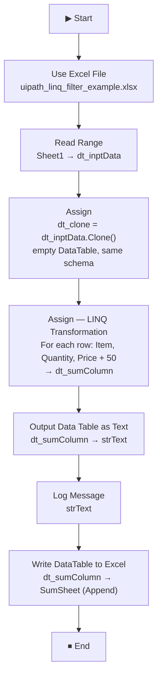

# FruitExample Sequence

A UiPath workflow sequence that reads fruit inventory data from Excel, uses a **LINQ transformation** to add a fixed value to each item's price, logs the result, and writes the transformed data back to a separate Excel sheet.

---

## 📋 Table of Contents

- [Overview](#overview)
- [Prerequisites](#prerequisites)
- [Workflow Logic](#workflow-logic)
- [Variables](#variables)
- [LINQ Expression Explained](#linq-expression-explained)
- [Input & Output Data](#input--output-data)
- [How to Run](#how-to-run)
- [Expected Output](#expected-output)
- [Troubleshooting](#troubleshooting)

---

## Overview

| Field | Details |
|---|---|
| **Workflow File** | `FruitExample.xaml` |
| **Part of Project** | LinqExcelOperation |
| **Framework** | Windows |
| **Expression Language** | Visual Basic |
| **Type** | Sequence |

This sequence demonstrates how to use **LINQ query syntax** in UiPath to **transform DataTable data** — specifically, reading fruit inventory rows and adding `50` to every item's price before writing the updated data to a new Excel sheet.

---

## Prerequisites

- **UiPath Studio** 2023.4 or later (Windows target framework)
- **Excel file** present at:
  ```
  E:\revision\UiPath Practice\LinqExcelOperation\uipath_linq_filter_example.xlsx
  ```
- The file must contain:
  - **`Sheet1`** — input sheet with columns: `Item`, `Quantity`, `Price`
  - **`SumSheet`** — output sheet where transformed results are appended (created automatically if it doesn't exist)

---

## Workflow Logic



### Step-by-Step Breakdown

| Step | Activity | What It Does |
|---|---|---|
| 1 | **Use Excel File** | Opens `uipath_linq_filter_example.xlsx` using the UiPath Excel engine |
| 2 | **Read Range** | Reads all rows from `Sheet1` into `dt_inptData` |
| 3 | **Assign** (`dt_clone`) | Clones the schema of `dt_inptData` into an empty DataTable `dt_clone` — preserves column names and types without copying rows |
| 4 | **Assign** (`dt_sumColumn`) | Runs a LINQ query to transform each row: copies `Item` and `Quantity` as-is, adds `50` to `Price`, and builds `dt_sumColumn` |
| 5 | **Output Data Table as Text** | Converts `dt_sumColumn` into a readable string `strText` |
| 6 | **Log Message** | Logs `strText` to the UiPath Output panel |
| 7 | **Write DataTable to Excel** | Appends `dt_sumColumn` to `SumSheet` in the same workbook |

---

## Variables

| Variable | Type | Scope | Description |
|---|---|---|---|
| `dt_inptData` | `DataTable` | FruitExample (outer) | Raw data read from `Sheet1` — Item, Quantity, Price |
| `dt_clone` | `DataTable` | Use Excel File → Do | Empty DataTable cloned from `dt_inptData` — acts as the row builder target |
| `dt_sumColumn` | `DataTable` | Use Excel File → Do | Transformed DataTable with `Price + 50` applied to every row |
| `strText` | `String` | Use Excel File → Do | Text representation of `dt_sumColumn` for logging |
| `Excel` | `IWorkbookQuickHandle` | Use Excel File → Do | Handle to the open workbook, used to reference sheets |

---

## LINQ Expression Explained

The core of this workflow is the LINQ transformation in `Assign_1`:

```vb
(From row In dt_inptData _
    Let x = New Object() { _
        row("Item").ToString, _
        row("Quantity").ToString, _
        (CInt(row("Price").ToString) + 50).ToString _
    } _
    Select dt_clone.Rows.Add(x) _
).CopyToDataTable()
```

### How it works line by line:

| Line | Meaning |
|---|---|
| `From row In dt_inptData` | Iterate over every row in the input DataTable |
| `Let x = New Object() { ... }` | Create a new row array with 3 values |
| `row("Item").ToString` | Copy the Item column value as-is |
| `row("Quantity").ToString` | Copy the Quantity column value as-is |
| `(CInt(row("Price").ToString) + 50).ToString` | Convert Price to Integer, add 50, convert back to String |
| `Select dt_clone.Rows.Add(x)` | Add the transformed row into `dt_clone` |
| `.CopyToDataTable()` | Materialise the LINQ result into a new DataTable → `dt_sumColumn` |

> 💡 **Why use `dt_clone`?**  
> `CopyToDataTable()` needs a DataTable with an existing schema to add rows into. `dt_inptData.Clone()` creates a structural copy (columns only, no data) that serves as the container.

---

## Input & Output Data

### Input — `Sheet1`

| Item | Quantity | Price |
|---|---|---|
| Apple | 10 | 100 |
| Banana | 25 | 40 |
| Mango | 8 | 200 |
| *(your rows)* | ... | ... |

### Output — `SumSheet` (Price + 50 applied)

| Item | Quantity | Price |
|---|---|---|
| Apple | 10 | 150 |
| Banana | 25 | 90 |
| Mango | 8 | 250 |
| *(your rows)* | ... | ... |

---

## How to Run

1. Open **UiPath Studio** and load the `LinqExcelOperation` project.
2. In the **Project panel**, right-click `FruitExample.xaml` → **Set as Main** (or invoke it from `Main.xaml`).
3. Ensure `uipath_linq_filter_example.xlsx` exists in the project folder with a populated `Sheet1`.
4. Click **Run** (F5) or **Debug** (F7).
5. View results in:
   - **Output panel** — the transformed table printed as text
   - **SumSheet** tab of the Excel file — appended rows with updated prices

---

## Expected Output

The Output panel should display the transformed DataTable, for example:

```
Item    | Quantity | Price
--------|----------|------
Apple   | 10       | 150
Banana  | 25       | 90
Mango   | 8        | 250
```

---

## Troubleshooting

| Issue | Cause | Fix |
|---|---|---|
| `CInt` conversion error | `Price` column contains non-numeric text or is empty | Clean the source data; add a `Try/Catch` or use `Integer.TryParse` |
| `SumSheet` not found error | Sheet doesn't exist in the workbook | Create a blank `SumSheet` tab in the Excel file first |
| Duplicate rows on re-run | `Append = True` on Write Range adds rows every run | Clear `SumSheet` before running, or change `Append` to `False` |
| `dt_clone` is Nothing | `Clone()` called on a null `dt_inptData` | Verify `Sheet1` exists and `Read Range` completed successfully |
| No output in Output panel | Output panel verbosity is set to `Error` only | Change the Output panel filter to **Verbose** or **Info** |

---

## Key Concept: LINQ Transformation vs. LINQ Filter

This project contains two sequences that showcase complementary LINQ patterns:

| | `FruitExample.xaml` | `Main.xaml` |
|---|---|---|
| **LINQ Purpose** | **Transform** — modify column values | **Filter** — select matching rows |
| **Syntax Style** | Query syntax (`From...Let...Select`) | Method syntax (`.Where(...).CopyToDataTable()`) |
| **Output** | All rows, Price increased by 50 | Only rows where Total contains "USD" |
| **Writes to Excel** | ✅ Yes — appends to `SumSheet` | ❌ No — logs only |

---

*Part of the LinqExcelOperation project · UiPath Studio Pro 26.0.195.0*
