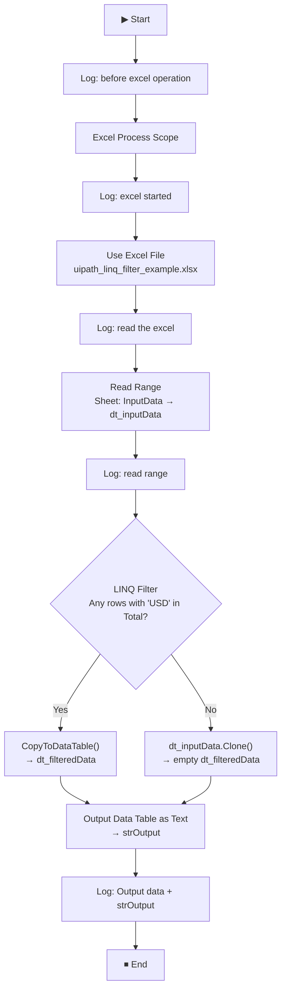

# LinqExcelOperation

A UiPath RPA process that reads data from an Excel file, filters rows using **LINQ** expressions, and logs the filtered output — demonstrating how to use LINQ queries with DataTable variables inside UiPath workflows.

---

## 📋 Table of Contents

- [Overview](#overview)
- [Prerequisites](#prerequisites)
- [Project Structure](#project-structure)
- [Workflow Logic](#workflow-logic)
- [Variables](#variables)
- [How to Run](#how-to-run)
- [Expected Output](#expected-output)
- [Troubleshooting](#troubleshooting)
- [Dependencies](#dependencies)

---

## Overview

| Field | Details |
|---|---|
| **Project Name** | LinqExcelOperation |
| **Type** | Process |
| **Framework** | Windows |
| **Expression Language** | Visual Basic |
| **Studio Version** | 26.0.195.0 |
| **Attended / Unattended** | Unattended |

This automation reads an Excel worksheet named `InputData`, filters all rows where the **Total** column contains `"USD"`, converts the result to readable text, and logs it to the UiPath Output panel.

---

## Prerequisites

- **UiPath Studio** 2023.4 or later (Windows target framework)
- **Excel file** present at:
  ```
  E:\revision\UiPath Practice\LinqExcelOperation\uipath_linq_filter_example.xlsx
  ```
- The Excel file must contain a sheet named **`InputData`** with at least a **`Total`** column
- No Excel installation required (uses UiPath's built-in Excel engine)

---

## Project Structure

```
LinqExcelOperation/
│
├── Main.xaml                          # Main workflow
├── project.json                       # UiPath project configuration
├── uipath_linq_filter_example.xlsx    # Input Excel file
└── README.md                          # This file
```

---

## Workflow Logic



### Step-by-Step Breakdown

1. **Log Message** — Logs `"before excel operation"` to confirm the process has started.
2. **Excel Process Scope** — Initialises the Excel engine and logs `"excel started"`.
3. **Use Excel File** — Opens `uipath_linq_filter_example.xlsx` without showing the Excel window.
4. **Log Message** — Logs `"read the excel"` before reading data.
5. **Read Range** — Reads all data from the `InputData` sheet into `dt_inputData`.
6. **Log Message** — Logs `"read range"` to confirm data was loaded.
7. **Assign (LINQ Filter)** — Filters rows where the `Total` column contains `"USD"`:
   ```vb
   If(dt_inputData.AsEnumerable.Any(Function(row) row("Total").ToString.Contains("USD")),
      dt_inputData.AsEnumerable.Where(Function(row) row("Total").ToString.Contains("USD")).CopyToDataTable(),
      dt_inputData.Clone())
   ```
8. **Output Data Table as Text** — Converts `dt_filteredData` into a formatted string `strOutput`.
9. **Log Message** — Logs `"Output data " + strOutput` showing the final filtered result.

---

## Variables

| Variable | Type | Scope | Description |
|---|---|---|---|
| `dt_inputData` | `DataTable` | Use Excel File → Do | Holds all rows read from the `InputData` sheet |
| `dt_filteredData` | `DataTable` | Use Excel File → Do | Holds only the rows where Total contains `"USD"` |
| `strOutput` | `String` | Use Excel File → Do | Text representation of the filtered DataTable |
| `Excel` | `IWorkbookQuickHandle` | Use Excel File → Do | Handle to the open Excel workbook |

---

## How to Run

1. Open **UiPath Studio** and load the project from:
   ```
   E:\revision\UiPath Practice\LinqExcelOperation
   ```
2. Ensure the Excel file exists at the path specified above.
3. Click **Run** (F5) or **Debug** (F7).
4. Check the **Output panel** in Studio (set verbosity to **Info** or **Verbose** to see all log messages).

---

## Expected Output

The Output panel should display messages in this order:

```
[Info] before excel operation
[Info] excel started
[Info] read the excel
[Info] read range
[Info] Output data <table with USD-filtered rows>
```

---

## Troubleshooting

| Issue | Cause | Fix |
|---|---|---|
| `Output Data Table as Text` fails | `dt_filteredData` is null — no rows matched the LINQ filter | Already handled: `.Clone()` returns an empty DataTable instead of null |
| `Read Range` throws an error | Excel file not found or sheet name is wrong | Verify the file path and that the sheet is named exactly `InputData` |
| No log messages visible | Output panel verbosity is set to `Error` only | Change the Output panel filter to **Verbose** or **Info** |
| `CopyToDataTable` exception | LINQ found no matching rows | Already handled with `.Any()` guard check |
| Excel file is locked | File open in Excel | Close the file in Excel before running |

---

## Dependencies

| Package | Version |
|---|---|
| `UiPath.Excel.Activities` | 3.5.2 |
| `UiPath.System.Activities` | 26.6.0 |

---

## Key Concept: LINQ with DataTable in UiPath

This project demonstrates a common UiPath pattern — filtering DataTable rows using LINQ:

```vb
' Safe pattern — handles zero-match case
If(dt_inputData.AsEnumerable.Any(Function(row) row("ColumnName").ToString.Contains("value")),
   dt_inputData.AsEnumerable.Where(Function(row) row("ColumnName").ToString.Contains("value")).CopyToDataTable(),
   dt_inputData.Clone())
```

> ⚠️ Always guard `CopyToDataTable()` with an `.Any()` check — calling it on an empty sequence throws an `InvalidOperationException`.

---

*Generated for UiPath Studio Pro · LinqExcelOperation v1.0.0*
