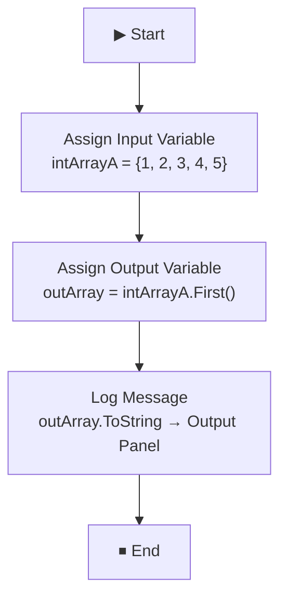

# UseOfDotFirst Sequence

A UiPath workflow sequence that demonstrates how to use the **`.First()`** LINQ method in UiPath to retrieve the first element from an integer array and log it to the Output panel.

---

## 📋 Table of Contents

- [Overview](#overview)
- [Workflow Logic](#workflow-logic)
- [Variables](#variables)
- [LINQ Method Explained](#linq-method-explained)
- [How to Run](#how-to-run)
- [Expected Output](#expected-output)
- [Troubleshooting](#troubleshooting)
- [Key Concept](#key-concept)

---

## Overview

| Field | Details |
|---|---|
| **Workflow File** | `UseOfDotFirst.xaml` |
| **Part of Project** | LinqExcelOperation |
| **Framework** | Windows |
| **Expression Language** | Visual Basic |
| **Type** | Sequence |

This is a focused learning sequence demonstrating the **`.First()`** LINQ extension method — how to initialise an integer array in UiPath and extract its first element into a separate variable for logging or further use.

---

## Workflow Logic



### Step-by-Step Breakdown

| Step | Activity | Expression | What It Does |
|---|---|---|---|
| 1 | **Assign Input Variable** | `new Int32(){1,2,3,4,5}` | Creates an integer array `{1, 2, 3, 4, 5}` and assigns it to `intArrayA` |
| 2 | **Assign Output Variable** | `intArrayA.First()` | Retrieves the **first element** of the array (`1`) and stores it in `outArray` |
| 3 | **Log Message** | `outArray.ToString` | Converts `outArray` to a string and logs it to the Output panel |

---

## Variables

| Variable | Type | Scope | Description |
|---|---|---|---|
| `intArrayA` | `Int32[]` | UseOfDotFirst (outer) | Input integer array initialised with values `{1, 2, 3, 4, 5}` |
| `outArray` | `Int32` | UseOfDotFirst (outer) | Stores the first element returned by `.First()` |

---

## LINQ Method Explained

### `.First()`

```vb
intArrayA.First()
```

| Detail | Description |
|---|---|
| **Method** | `Enumerable.First()` |
| **Input** | Any `IEnumerable` — arrays, lists, DataTable rows, etc. |
| **Output** | The **first element** of the sequence |
| **Throws** | `InvalidOperationException` if the sequence is **empty** |
| **Safe alternative** | `.FirstOrDefault()` — returns the type's default value (`0` for Int32) if the sequence is empty instead of throwing |

### Variants you can use in UiPath

| Expression | Behaviour |
|---|---|
| `intArrayA.First()` | Returns first element — throws if array is empty |
| `intArrayA.FirstOrDefault()` | Returns first element — returns `0` if array is empty |
| `intArrayA.First(Function(x) x > 2)` | Returns first element **matching a condition** (`3`) |
| `intArrayA.FirstOrDefault(Function(x) x > 10)` | Returns `0` if no element matches the condition |

### Visualising the array

```
intArrayA = { 1,  2,  3,  4,  5 }
               ↑
           .First() returns this → outArray = 1
```

---

## How to Run

1. Open **UiPath Studio** and load the `LinqExcelOperation` project.
2. In the **Project panel**, right-click `UseOfDotFirst.xaml` → **Set as Main** (or invoke it from `Main.xaml`).
3. Click **Run** (F5) or **Debug** (F7).
4. Check the **Output panel** — ensure verbosity is set to **Info** or **Verbose**.

> No Excel file or external dependencies are needed — this sequence runs entirely in memory.

---

## Expected Output

The Output panel should display:

```
1
```

This is the first element of the array `{1, 2, 3, 4, 5}`.

---

## Troubleshooting

| Issue | Cause | Fix |
|---|---|---|
| `InvalidOperationException: Sequence contains no elements` | `.First()` called on an empty array | Use `.FirstOrDefault()` instead, or check the array has elements before calling `.First()` |
| Nothing printed in Output panel | Output panel verbosity is set to `Error` only | Change the filter to **Verbose** or **Info** |
| `outArray` always shows `0` | Using `.FirstOrDefault()` on an empty array returns the default Int32 value | Verify `intArrayA` is populated before calling the method |

---

## Key Concept

### `.First()` vs `.FirstOrDefault()`

This sequence uses `.First()` which is straightforward for a known non-empty array. In production workflows, prefer `.FirstOrDefault()` for safety:

```vb
' ❌ Risky — throws if array is empty
outArray = intArrayA.First()

' ✅ Safe — returns 0 if array is empty
outArray = intArrayA.FirstOrDefault()

' ✅ Safe with condition — returns first match or 0
outArray = intArrayA.FirstOrDefault(Function(x) x > 3)
```

### Where `.First()` is commonly used in UiPath

| Scenario | Example |
|---|---|
| Get first matching DataRow | `dt.AsEnumerable.First(Function(r) r("Name").ToString = "Alice")` |
| Get first item in a List | `myList.First()` |
| Get first file matching a pattern | `Directory.GetFiles(path, "*.xlsx").First()` |
| Get first non-empty string | `strArray.First(Function(s) s <> String.Empty)` |

---

## LINQ Method Comparison in This Project

| Workflow | LINQ Method Used | Purpose |
|---|---|---|
| `UseOfDotFirst.xaml` | `.First()` | Retrieve the first element of an array |
| `Main.xaml` | `.Where()` + `.Any()` | Filter DataTable rows by condition |
| `FruitExample.xaml` | `From...Let...Select` | Transform and rebuild DataTable rows |

---

*Part of the LinqExcelOperation project · UiPath Studio Pro 26.0.195.0*
